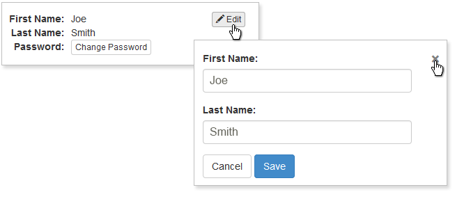

toggleForm
==========


Very simply plugin that shows/hides forms associated with editing bits of data.
Useful for a screen where you might have multiple forms, like an account settings screen.

[View Example](http://x2gboye.github.io/toggleForm/index.html).

Requirements
------------

jQuery (>= 1.7)

Usage
-----

```html
<!-- HTML -->

<div class="some-div">
    
    <div class="data">
        <dl>
            <dt>First Name:</dt>
            <dd>Joe</dd>
            <dt>Last Name:</dt>
            <dd>Smith</dd>
        </dl>
        <button type="button" class="edit" data-toggle="#customerForm">Edit</button>
    </div>
    
    <div class="form" id="customerForm">
        <form>
            <p><label>First Name:</label>
                <input type="text" value="Joe" /></p>
            <p><label>Last Name:</label>
                <input type="text" value="Smith" /></p>
            <p>
              <button type="button" class="cancel">Cancel</button>
              <button type="submit">Submit</button>
            </p>
        </form>
    </div>
    
</div>
```
**Note:** each "edit" button requires a ```data-toggle``` attribute with a value of **# + the id of the form container it should show**

```javascript
//JavaScript

$('.some-div').toggleForm(options);
```

**Note:** ```options``` is an optional javascript object with parameters explained below.

Options
-------

<table>
    <thead>
    	<tr>
    		<th>Option</th>
    		<th>Default</th>
    		<th>Description</th>
    	</tr>
    </thead>
    <tbody>
    	<tr>
    		<td><strong>edit</strong></td>
    		<td>button.edit</td>
    		<td>selector for your "edit" button, or the element intended to show the form when clicked</td>
    	</tr>
    	<tr>
    		<td><strong>cancel</strong></td>
    		<td>button.cancel</td>
    		<td>selector for your "cancel" button, or the element intended to hide the form when clicked</td>
    	</tr>
    	<tr>
    		<td><strong>data</strong></td>
    		<td>.data</td>
    		<td>selector for your "data" container element</td>
    	</tr>
    	<tr>
    		<td><strong>form</strong></td>
    		<td>.form</td>
    		<td>selector for your "form" container element</td>
    	</tr>
    	<tr>
    		<td><strong>close</strong></td>
    		<td>close</td>
    		<td>css class name for the "close [x]" button</td>
    	</tr>
    	<tr>
    		<td><strong>hideOtherForms</strong></td>
    		<td>true</td>
    		<td>whether or not other to hide all other toggleForms when another "edit" button is clicked,
so only one form is visible at a time.</td>
    	</tr>
    </tbody>
</table>

```javascript
//example

$('.some-div').toggleForm({
	edit: 'button.edit',
	cancel: 'button.cancel',
	data: '.data',
	form: '.form',
	close: 'close',
	hideOtherForms: true
});
```

Methods
-------

- **showData**
hides the "form" container and "close [x]" button and shows the "data" container

	```javascript
	$('.some-div').toggleForm('showData');
	```

- **showForm**
hides the "data" container and shows the "close [x]" button and "form" container

	```javascript
	$('.some-div').toggleForm('showForm');
	```
- **destroy**
removes the "close [x]" button, shows the "data" and "form" containers,
unbinds click events for "edit" and "cancel" buttons

	```javascript
	$('.some-div').toggleForm('destroy');
	```

